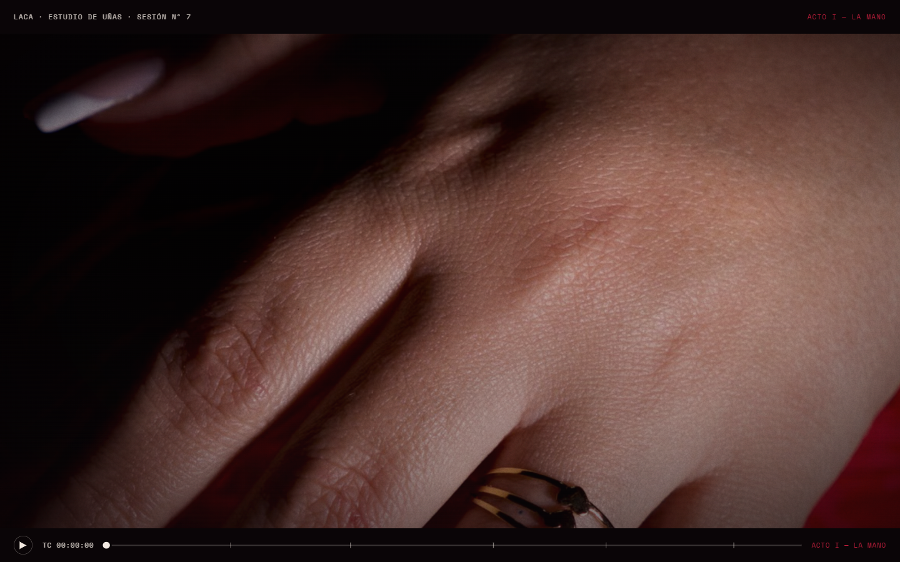
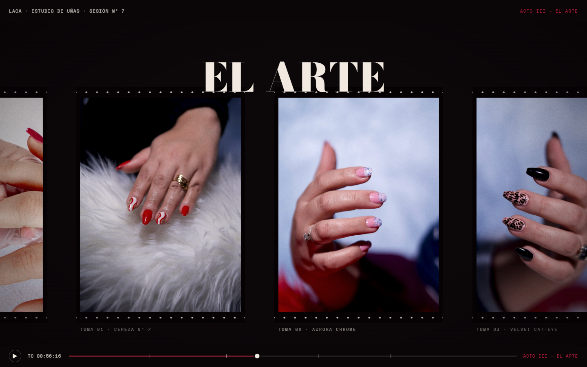

# LACA — Estudio de uñas · Una sesión en cinco actos

**Ver en vivo → [https://b0b1a6ae23.github.io/laca-estudio-unas/](https://b0b1a6ae23.github.io/laca-estudio-unas/)**


Landing page **cinemática** para un estudio de uñas dark-editorial: la página se
comporta como una sesión de manicure filmada, narrada en cinco actos que se
desenvuelven **solo con scroll** — sin clics, sin gating.

| Hero | Sección |
| --- | --- |
|  |  |

## Concepto

Cada acto de la sesión (diagnóstico, preparación, color, sellado, reveal) es una
escena scrolleada con dirección de arte propia. La sensación de video se logra
sin ningún reproductor: escenas fijadas (pin + scrub), cortes de montaje,
tipografía editorial y fotografía real.

## Técnicas

- **GSAP ScrollTrigger** con escenas pinned y `scrub` — el scroll es la línea de tiempo.
- Lens stack cinematográfico: viñeta, grano generado en canvas (tile + jitter), flashes de corte.
- Subtítulos por cues de progreso local en cada escena.
- Fotografía real vía Pexels con hotlink + `srcset` generado en runtime.
- Créditos rodantes y endcard como cierre de "función".

## Cómo correr

Es un sitio estático de un solo archivo:

```bash
npx http-server . -p 8080
# → http://localhost:8080
```

## Licencia

Código bajo licencia [MIT](LICENSE). **LACA** es una marca ficticia creada para demostrar trabajo de portafolio; cualquier parecido con un negocio real es coincidencia. Los recursos de terceros (fotografías, videos y modelos 3D) conservan la licencia original de sus autores — ver Créditos.

## Créditos

Fotografía: [Pexels](https://www.pexels.com) (licencia Pexels).

---
**Ángel Josué García Cantero** · Proyecto de la serie *páginas-película* (11 sitios con vocabularios de animación distintos).